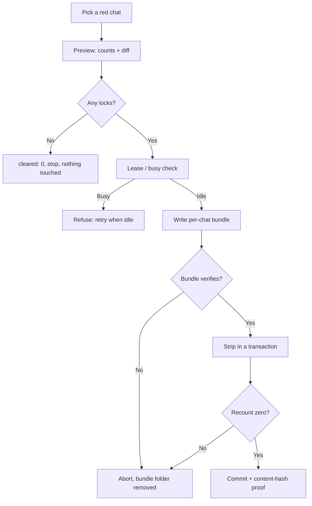
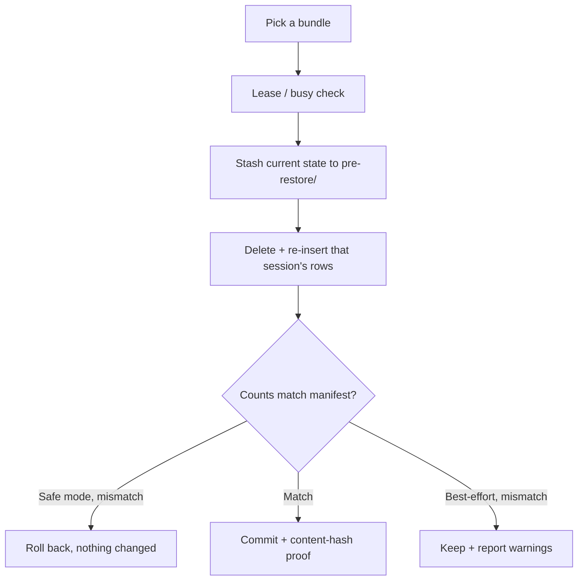

# Architecture

How Session Doctor is put together and why each piece exists. For daily use
see [OPERATIONS](OPERATIONS.md); for hacking see [DEVELOPMENT](DEVELOPMENT.md).

## The one-paragraph version

Two chat databases (Hermes, OpenCode) each get a small read-only inspector,
a per-chat backup writer, a minimal in-place fixer, and a row-level
restorer. A single stdlib Python server exposes both over a loopback-only
JSON API. A Next.js dashboard talks to that API. Every destructive step is
gated the same way: **backup first, verify, then mutate transactionally —
or roll everything back.**

## Repository map

```
session-doctor/
├── setup.sh / run.sh          one-command setup · daily launcher
├── src/session_doctor/        the whole engine + API (stdlib Python only)
│   ├── db.py                  Hermes reads (query_only, never writes)
│   ├── backup.py              Hermes per-chat bundles (+ legacy snapshots)
│   ├── fix.py                 Hermes seal strip (one column, one session)
│   ├── restore.py             Hermes row-level restore (safe + best-effort)
│   ├── ocdb.py                OpenCode reads (query_only, never writes)
│   ├── ocbackup.py            OpenCode per-chat bundles
│   ├── ocfix.py               OpenCode blob-key strip
│   ├── ocrestore.py           OpenCode row-level restore
│   ├── jsonbytes.py           bytes-safe JSON codec for bundles + API
│   └── server.py              loopback HTTP API + serves the built UI
├── tests/                     27-test safety net (throwaway DBs only)
├── web/                       Next.js + Tailwind dashboard (source only)
├── scripts/                   doctor.sh helper + Swift menu-bar app source
├── settings.json              local config (git-ignored, auto-created)
└── backups/                   per-chat bundles (git-ignored, auto-created)
```

## The two backends

### Hermes (`~/.hermes/state.db`, or `$HERMES_HOME`)

Tables that matter: `sessions` (one row per chat) → `messages` (linked by
`session_id`) plus `session_turn_leases` (who holds a live turn).

- A **lock** is a non-empty `messages.codex_reasoning_items` value: a sealed
  reasoning envelope the current caller was never issued. The fix sets that
  one column to `NULL` for one session. Visible chat, summaries, tool
  results, and all other sessions are byte-identical afterwards.
- A chat **holds a lease** when `session_turn_leases` has a row for it.
  Fix and restore refuse leased sessions with HTTP 500 and a
  "retry when idle" message.
- Provenance proof is `session_content_hash`: sha256 over ordered
  `(id, content, codex_message_items)` — deliberately excluding the stripped
  column, so a correct fix leaves the hash unchanged.

### OpenCode (`~/.local/share/opencode/opencode.db`, or `$OPENCODE_HOME`)

Tables: `session` → `message` → `part` (all linked by `session_id`).

- A **lock** is a structured blob key inside `part.data` JSON, at
  `metadata.openai.reasoningEncryptedContent` (legacy top-level
  `encrypted_content` / `redacted_thinking` / `reasoning_content` match too).
  Detection uses `json_extract` on the key path — chat text that merely
  *mentions* the error never matches.
- The fix removes only that nested key (`json_remove`). Rows, reply chains,
  summaries, and the caller-bound `itemId` reference stay put.
- There is no lease table, so **busy** means `session.time_compacting` is
  set or a `BEGIN IMMEDIATE` + `ROLLBACK` probe hits a writer. Same refusal
  behavior as a Hermes lease.
- Provenance proof is the same idea over `(part.id, type, text)`.

## Why locks happen

Think of a sealed envelope as `{payload, issued-to}`. The `issued-to` half
is the requesting identity: which route served the request *and* where it
came from. A retry replays the chat's stored envelopes, and the provider
accepts them only when the replaying requester matches `issued-to`.

That gives the two observed triggers one shared mechanism:

1. **Proxy re-route** — Hermes serves OpenCode models (free ones like Muse
   Spark, paid subscriptions like OpenCode Zen and OpenCode Go) through its
   proxy. When the next turn goes out under a different upstream caller,
   every envelope from the old caller is rejected.
2. **IP change mid-session** — ISP rotations, VPN on/off, travel, or simply
   reconnecting from a new network while continuing the same session ID.
   Same route, different egress: the envelopes were issued to someone at the
   old address.

Either way the chat is healthy and nothing is corrupt — the caller just
isn't the one on the envelope. The fix deletes the payloads and keeps the
rest: context, tool calls, commands, and responses continue exactly as they
were, which is why a fixed chat resumes mid-conversation instead of
restarting it.

## Safety invariants (both backends, no exceptions)

1. **Reads never write.** All inspection goes through `query_only`
   connections. The read modules contain zero write statements.
2. **No backup, no fix.** The fix endpoint takes a backup first; if the
   backup or its verification fails, the fix never runs.
3. **Verify or abort.** Every bundle is re-opened and compared
   (counts + content hash) before it is trusted.
4. **Transactional mutation with self-check.** `BEGIN IMMEDIATE`, mutate,
   recount inside the transaction, `ROLLBACK` on any mismatch.
5. **Row-level restore only.** Restores delete and re-insert one session's
   rows. Whole-file replacement is never done — other sessions keep moving.
6. **Restoring stashes first.** Every restore backs up current state to
   `pre-restore/`, so undoing the undo works.
7. **Zero is a valid answer.** No locks means `cleared: 0`, no backup taken,
   nothing touched.

## Fix flow



## Restore flow



## Bundle formats

Per-chat bundle: `<root>/<session-id>_<UTC>/` with `rows.json` (the rows),
`manifest.json` (counts, fingerprint, `verified` flag), `export.md` /
`export.jsonl` (readable transcript), `RESTORE.txt` (human instructions).

- Hermes bundles live under `backups/`; OpenCode under `backups/opencode/`.
- BLOB columns survive via the `jsonbytes` codec (`{"$bytes": "<base64>"}`),
  decoded back to exact bytes on restore.
- Legacy Hermes full-DB snapshots (`state.db.snapshot`) still restore: the
  fixer detects bundle kind by what's inside. New code only writes
  per-chat bundles.
- A bundle that fails verification, or any backup that throws, has its
  folder removed — failed backups leave no corpses.

## API and frontend

- `server.py` is stdlib-only (`http.server`), bound to `127.0.0.1`
  (default port `8765`, overridable). No auth — loopback binding *is* the
  access control. Dev CORS allows `http://localhost:3000` for `next dev`.
- Hermes routes live at `/api/*`; OpenCode mirrors at `/api/oc/*` with
  identical contracts. Full reference: [DEVELOPMENT](DEVELOPMENT.md#api-reference).
- The dashboard (`web/`, Next.js static export served by the same server)
  is a pure client: it fetches, renders, and confirms — all safety logic
  lives server-side, so the UI can never talk the engine into skipping a
  backup.

## Threat model (short, honest)

- Anyone on your machine who finds the port can drive the API. That is the
  accepted tradeoff for a passwordless local tool (your call, kept).
- Nothing listens on the network, nothing leaves the machine, nothing is
  uploaded. Backup folders are yours to place — don't point one at a synced
  folder unless you mean it.
- The most dangerous operation offered is bulk fix; it is sequential,
  per-chat-backed, cancellable between chats, and every chat stays
  individually restorable.
